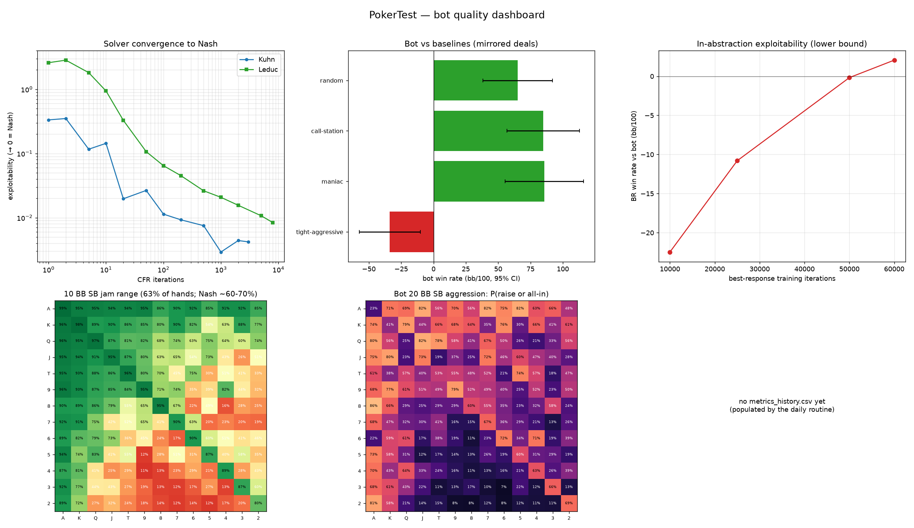

# PokerTest — a CFR poker bot with an objective evaluation

This repository builds the strongest poker bot it reasonably can **and**, just
as importantly, an *objective* way to measure how good it is. In computer
poker the gold-standard quality metric is **exploitability** — the distance from
a game-theoretic optimal (Nash) strategy. A perfect bot is unexploitable; the
closer to 0, the better. Where the game is small enough we compute
exploitability *exactly* and prove near-optimality; where it isn't (real
No-Limit Hold'em) we bound it and corroborate with head-to-head results and
comparison to published theory.

## What's here

| Component | File(s) | What it does |
|---|---|---|
| Hand evaluator | `pokerbot/evaluator.py` | Exact 5–7 card evaluator (Cactus-Kev-style lookup tables), validated against textbook hand frequencies. |
| Extensive-form games | `pokerbot/games/` | Kuhn, Leduc, and heads-up No-Limit Hold'em behind one interface. |
| Solvers | `pokerbot/solve/cfr.py`, `tree.py` | Vanilla CFR, CFR+, **Discounted CFR**; exact best-response / exploitability. |
| Monte-Carlo CFR | `pokerbot/solve/mccfr.py`, `nlhe_tree.py` | Chance-sampling MCCFR for NLHE over a compiled betting tree (fast). |
| Agents | `pokerbot/agents/` | The trained bot plus a panel of baselines. |
| Evaluation | `pokerbot/eval/` | Mirrored-deal arena (mbb/100 + 95% CIs), best-response exploitability. |
| Metrics | `pokerbot/metrics.py` | Single source of truth for all objective numbers. |
| Report | `pokerbot/evaluate.py` | Runs every objective check and writes `EVALUATION.md`. |
| Visualizations | `pokerbot/visualize.py` | Renders `figures/*.png` (dashboard, convergence, win rates, push/fold grid). |

## The objective evaluation

Four independent checks, each reproducible from the code:

1. **Hand evaluator** — enumerate all 2,598,960 five-card hands; the per-category
   counts must match the textbook exactly (they do), and there must be exactly
   7462 distinct hand values.
2. **Kuhn poker** — the solver must drive exploitability to ~0, recover a
   strategy on the *analytic* Nash one-parameter family, and reproduce the
   known game value of **−1/18** to the first player.
3. **Leduc hold'em** — on the exact 288-information-set game tree, CFR must
   drive exploitability monotonically toward 0.
4. **No-Limit Hold'em bot** —
   - win rate vs a panel of baselines in **mbb/100** with 95% confidence
     intervals, using *mirrored (duplicate) deals* so we measure skill, not card
     luck;
   - an **in-abstraction exploitability** estimate from a best response trained
     against the fixed bot;
   - a short-stack **push/fold** range compared to the known Nash push/fold
     equilibrium.

Why this matters: beating weak baselines is necessary but not sufficient — a bot
can crush calling stations yet be wildly exploitable. Exploitability is the
honest metric, so it's front and center here.

## Reproduce

```bash
pip install numpy pytest matplotlib   # numpy/matplotlib optional; pytest for tests
python -m pokerbot.evaluate --quick                # fast pass
python -m pokerbot.evaluate --out EVALUATION.md    # the committed report
python -m pokerbot.visualize --level standard      # writes figures/
pytest -q                                          # correctness tests
```

## Visualizations

`figures/dashboard.png` is the at-a-glance panel; the individual figures live
beside it.



- **Solver convergence** — Kuhn & Leduc exploitability falling toward 0 (Nash).
- **Bot vs baselines** — win rate in bb/100 with 95% CIs (green = beats, red = loses).
- **In-abstraction exploitability** — a best response's win rate vs the bot as it
  trains; the plateau is a lower bound on how exploitable the bot is.
- **Push/fold grid** — the 13×13 hand grid of the 10 BB SB jam range vs Nash.
- **Pre-flop aggression** — the bot's 20 BB opening strategy.
- **Progress over time** — `metrics_history.csv` plotted across days (filled in
  by the daily routine).

## Improving the bot daily

`routines/daily_improvement.md` is a standalone prompt for an autonomous daily
run: it records the current bot's metrics, tries **one** scoped improvement,
measures it with the same objective evaluation, and keeps the change only if it
is a real, regression-free win — appending a row to `metrics_history.csv` and an
entry to `EXPERIMENTS.md` either way.

**`DEPENDENCIES.md` is required reading before changing anything** — it maps what
moves when you touch each piece (e.g. change the abstraction ⇒ the bot, every
figure, and the report all change).

## Method notes

- **Discounted CFR (DCFR)** is the default solver: positive/negative regrets and
  the average-strategy weights get separate polynomial discounts, which
  outperforms vanilla CFR on Leduc-scale games.
- The NLHE bot uses an **action abstraction** (pot-sized bet + all-in) and a
  **card abstraction** (lossless 169 pre-flop hands + made-hand-strength buckets
  post-flop). The post-flop abstraction ignores draw potential — a documented
  approximation that trades some strength for the speed needed to train in pure
  Python.
- The betting tree's *structure* is card-independent, so it is **compiled once**
  and each Monte-Carlo deal only plugs in the showdown winner and the card
  buckets — about a 20× speedup over walking game objects.

See `EVALUATION.md` for the latest numbers.
